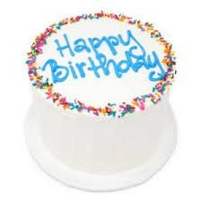

# Cake

## Description
I love cake and want to eat more.

## Table of Contents
- [Installation](#installation)
- [Usage](#usage)
- [License](#license)
- [Contributing](#contributing)
- [Tests](#tests)
- [Questions](#questions)

## Installation
I have to bake the cake. First, eggs and sugar, then butter.

## Usage
Put all ingredients in bowl and mix.

## Credits
My mom helped me bake the cake. Thanks mom!

## Tests
Test 1 2

## Questions 
Do you know how to bake?

Please also check out my GitHub Profile if you would like:

https://github.com/kylaerod/

## License

This project is licensed under the MIT - see the [LICENSE.md]([MIT License](https://opensource.org/licenses/MIT)) file for details.
